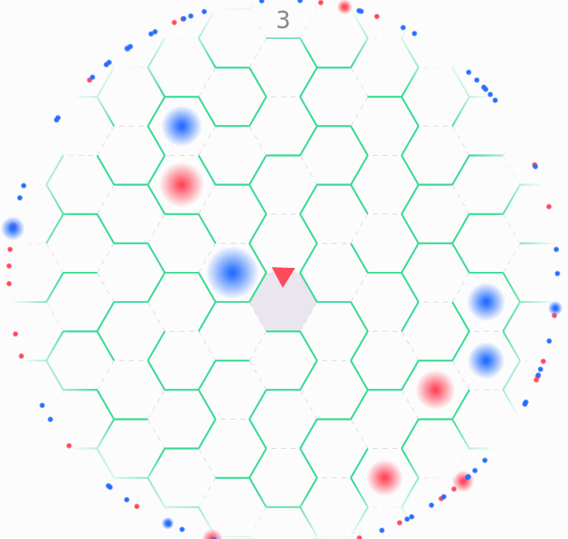

# Haze

Haze is a simple maze game on hexagonal tiles, the aim is to keep on roaming the maze for as long as possible collecting points on the way.

The game is available online at [basile-henry.github.io/haze/](https://basile-henry.github.io/haze/).



## How to play

Simply place your mouse in the direction you want go!

There are two kinds of "orbs" that can be found in the maze:

- Blue orbs give you more time (which is represented by the field of view)

- Red orbs randomize the maze and give you a 25 point bonus

To cover more grounds quicker simply build up speed by moving to next tile as soon as possible. If you don't choose a direction fast enough you might lose all of your momentum.

## How to build

The game is written in [Elm](http://elm-lang.org/) so you'll need elm-make:

```sh
elm make src/Main.elm --output index.html
```

Or even simpler, use `elm reactor` and then open `http://localhost:8000/` in your browser.

## License

[MIT License](LICENSE)

Copyright (c) 2016 Basile Henry
